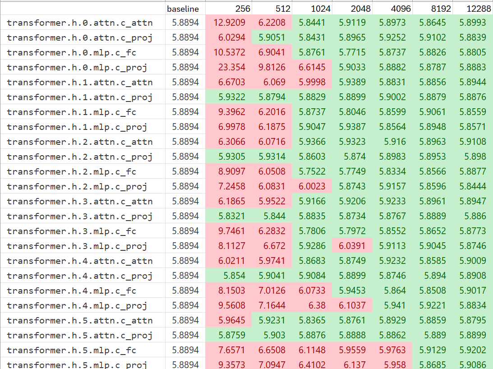

# M3 Layerwise Grid Search

This file contains a single-layer-at-a-time M3 grid search over all 6 transformer blocks and the 4 linear layers in each block.

Layers tested:
- `attn.c_attn`
- `attn.c_proj`
- `mlp.c_fc`
- `mlp.c_proj`

Baseline PPL: **5.8894**

| Layer | Baseline PPL | k=256 | k=512 | k=1024 | k=2048 | k=4096 | k=8192 | k=12288 |
| --- | ---: | ---: | ---: | ---: | ---: | ---: | ---: | ---: |
| `transformer.h.0.attn.c_attn` | 5.8894 | 12.9209 | 6.2208 | 5.8441 | 5.9119 | 5.8973 | 5.8645 | 5.8993 |
| `transformer.h.0.attn.c_proj` | 5.8894 | 6.0294 | 5.9051 | 5.8431 | 5.8965 | 5.9252 | 5.9102 | 5.8839 |
| `transformer.h.0.mlp.c_fc` | 5.8894 | 10.5372 | 6.9041 | 5.8761 | 5.7715 | 5.8737 | 5.8826 | 5.8805 |
| `transformer.h.0.mlp.c_proj` | 5.8894 | 23.3540 | 9.8126 | 6.6145 | 5.9033 | 5.8882 | 5.8787 | 5.8883 |
| `transformer.h.1.attn.c_attn` | 5.8894 | 6.6703 | 6.0690 | 5.9998 | 5.9389 | 5.8831 | 5.8856 | 5.8944 |
| `transformer.h.1.attn.c_proj` | 5.8894 | 5.9322 | 5.8794 | 5.8829 | 5.8899 | 5.9002 | 5.8879 | 5.8876 |
| `transformer.h.1.mlp.c_fc` | 5.8894 | 9.3962 | 6.2016 | 5.8737 | 5.8046 | 5.8599 | 5.9061 | 5.8559 |
| `transformer.h.1.mlp.c_proj` | 5.8894 | 6.9978 | 6.1875 | 5.9047 | 5.9387 | 5.8564 | 5.8948 | 5.8571 |
| `transformer.h.2.attn.c_attn` | 5.8894 | 6.3066 | 6.0716 | 5.9366 | 5.9323 | 5.9160 | 5.8963 | 5.9108 |
| `transformer.h.2.attn.c_proj` | 5.8894 | 5.9305 | 5.9314 | 5.8603 | 5.8740 | 5.8983 | 5.8953 | 5.8980 |
| `transformer.h.2.mlp.c_fc` | 5.8894 | 8.9097 | 6.0508 | 5.7522 | 5.7749 | 5.8334 | 5.8566 | 5.8877 |
| `transformer.h.2.mlp.c_proj` | 5.8894 | 7.2458 | 6.0831 | 6.0023 | 5.8743 | 5.9157 | 5.8596 | 5.8444 |
| `transformer.h.3.attn.c_attn` | 5.8894 | 6.1865 | 5.9522 | 5.9166 | 5.9206 | 5.9233 | 5.8961 | 5.8947 |
| `transformer.h.3.attn.c_proj` | 5.8894 | 5.8321 | 5.8440 | 5.8835 | 5.8734 | 5.8767 | 5.8889 | 5.8860 |
| `transformer.h.3.mlp.c_fc` | 5.8894 | 9.7461 | 6.2832 | 5.7806 | 5.7972 | 5.8552 | 5.8652 | 5.8773 |
| `transformer.h.3.mlp.c_proj` | 5.8894 | 8.1127 | 6.6720 | 5.9286 | 6.0391 | 5.9113 | 5.9045 | 5.8746 |
| `transformer.h.4.attn.c_attn` | 5.8894 | 6.0211 | 5.9741 | 5.8683 | 5.8749 | 5.9232 | 5.8585 | 5.9009 |
| `transformer.h.4.attn.c_proj` | 5.8894 | 5.8540 | 5.9041 | 5.9084 | 5.8899 | 5.8746 | 5.8940 | 5.8908 |
| `transformer.h.4.mlp.c_fc` | 5.8894 | 8.1503 | 7.0126 | 6.0733 | 5.9453 | 5.8640 | 5.8508 | 5.9017 |
| `transformer.h.4.mlp.c_proj` | 5.8894 | 9.5608 | 7.1644 | 6.3800 | 6.1037 | 5.9410 | 5.9221 | 5.8834 |
| `transformer.h.5.attn.c_attn` | 5.8894 | 5.9645 | 5.9231 | 5.8365 | 5.8761 | 5.8929 | 5.8859 | 5.8795 |
| `transformer.h.5.attn.c_proj` | 5.8894 | 5.8759 | 5.9030 | 5.8876 | 5.8888 | 5.8862 | 5.8890 | 5.8899 |
| `transformer.h.5.mlp.c_fc` | 5.8894 | 7.6571 | 6.6508 | 6.1148 | 5.9559 | 5.9763 | 5.9129 | 5.9202 |
| `transformer.h.5.mlp.c_proj` | 5.8894 | 9.3573 | 7.0947 | 6.4102 | 6.1370 | 5.9580 | 5.8685 | 5.9086 |

If we apply perplexity threshold of 5.950, we can observe the most and least stable layers.

